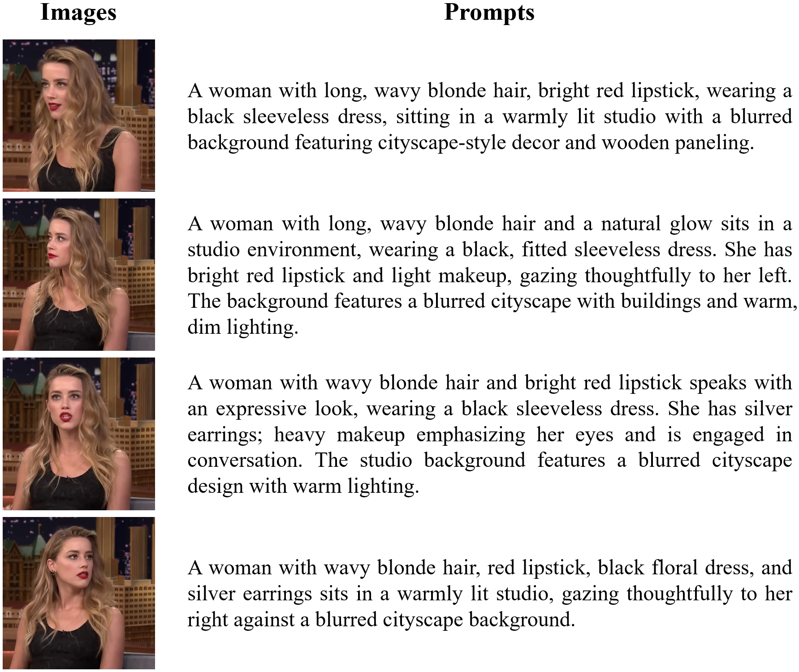

# HP3

Once the paper is accepted, we will open source the model weights and dataset.

## Dataset

The dataset contains 31k ID groups and 179k text-image pairs. 

Here is an example of an ID group in the dataset:

